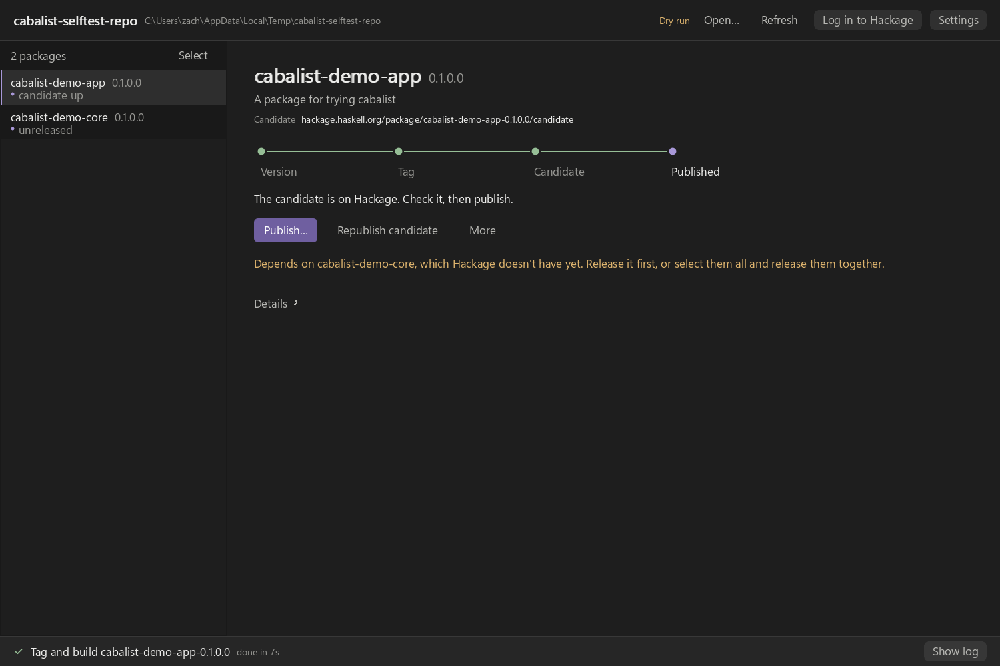

# cabalist

A GUI for making Hackage releases of Haskell packages, in the careful,
stepped style of [hkgr](https://github.com/juhp/hkgr), built on
[nano-ui](https://github.com/goolord/nano-ui). It works with a repository
holding one package at its root or many in subdirectories of a monorepo.



Open a git repository and cabalist lists every Cabal package in it. Each
package's release is a track of four stops, with one button for the next
step. The stops are controls too: clicking the one a release stands at takes
that step, and clicking one it has passed makes that stop's result again,
which is how a release goes back. Hovering a stop says what clicking it would
do.

1. **Version.** When the package has changed since its version was released
   (counted from its tag, or from Hackage's upload time when the release was
   never tagged), *Bump version…* increments a component of the version
   (under the PVP, `A.B` is the major version), adds a changelog entry, and
   can commit both.
2. **Tag.** *Tag and build* tags the version, clones the repository at the
   tag into a temporary directory, and runs `cabal check`, `hlint` (advice
   only) and `cabal sdist` there, so the tarball holds exactly what the tag
   holds. It then builds the tarball in a clean directory, which catches files
   missing from `extra-source-files` and friends. If any of that fails, the tag
   goes back to where it was. Tarballs land in `.cabalist/` at the repository
   root, a directory git ignores without any change to your `.gitignore`.
3. **Candidate.** *Upload candidate* uploads the tarball as a Hackage
   candidate, to check before releasing, or skip it with *Publish now…*. To
   fix something the candidate showed, commit the fix and click the **Tag**
   stop: *Replace the tag and tarball* moves the tag to the new commit and
   makes the tarball again over the old one. Clicking the **Candidate** stop
   of a candidate that is already up does that and uploads it in the old
   one's place — *Republish candidate*, as often as needed. A tag is local
   until the version is published, so both can be repeated freely until then.
4. **Published.** *Publish…* pushes the branch (when the tag is ahead of it)
   and the tag to your remote, publishes the release, and marks the version
   so cabalist never releases it again. It asks for confirmation first.

While a candidate is up, or once the version is released, a link under the
package's name opens it on Hackage.

Everything else a release can need is under *More*: checking the package,
rebuilding from the tarball, uploading or publishing documentation, and
*Remove tag and tarball*, which goes back past the tag and leaves nothing in
its place. Notes under the button point out
what would spoil a release: uncommitted changes, commits after the tag, a
changelog with no entry for the version, a dependency in the same repository
that Hackage does not have yet.

## Running a release

Steps run in the background, one at a time. The bar at the bottom reports the
current one, and *Show log* shows its output; a failed step opens the log by
itself. A version that is already published cannot be tagged, uploaded or
published again, as with hkgr.

## Monorepos

- Every `.cabal` file git knows about is a package, wherever it sits; files
  git ignores (such as those under `dist-newstyle`) are skipped.
- cabal runs in the package's own directory with a `cabal.project` of its
  own, so a project file at the repository root does not pull the other
  packages into a release.
- Tags name the package: `nano-ui-v0.2.0.0`. The format is guessed from the
  tags already in the repository (`v{version}` for a single package at the
  root, `{name}-v{version}` for a monorepo) and can be changed in *Settings*.
- *Select* several packages to tag, upload or publish them together. They run
  in dependency order, so a package's dependencies in the repository go
  first, and if one step fails the rest of the batch is skipped.
- A pristine build uses the repository's own copy of any dependency Hackage
  does not have yet, and says so in the log. *Build against this repository's
  own dependencies*, in *Settings*, does that for every dependency.

## Logging in to Hackage

cabal uploads with whatever login its config file holds (a token, a password
command, or a username and password). Without one, set a username and
password or an API token with *Log in to Hackage*. *Remember it* saves the
login in the operating system's keyring (Windows Credential Manager, the
macOS keychain, or the Secret Service through `secret-tool` on Linux) for the
next time cabalist starts; otherwise it stays in memory until cabalist
closes. Neither kind reaches cabal on its command line, where other programs
could read it: a password goes on cabal's standard input, and a token in a
temporary copy of cabal's config file, deleted after the upload.

## Trying it safely

*Dry run*, in *Settings* (or `cabalist --dry-run`), runs every step but logs
the uploads and pushes instead of doing them.

## Running

```sh
cabal run cabalist -- [--dry-run] [DIRECTORY]
```

cabalist opens the repository containing `DIRECTORY`, or the current
directory's repository, or the one opened last.

It needs `git`, `cabal`, `tar` and `curl` on the `PATH`, and uses `hlint` if
it is there. When several cabals are on the `PATH`, cabalist uses the newest.

## Building

You need GHC 9.14, and SDL3 and SDL3_ttf for nano-ui's SDL backend.
`cabal.project` pins nano-ui to a commit on GitHub.

```sh
cabal build
cabal test                                # the release steps, on a throwaway monorepo
cabal run cabalist -- --selftest shots    # the window, driven headlessly; screenshots in shots/
cabal run cabalist -- --screenshot out.bmp DIRECTORY
```

The self-test builds a two-package monorepo in the temporary directory, then
tags and builds one package through the window, opens each dialog, and
uploads candidates of both in dependency order, all in dry-run mode.

### Release builds

```sh
runghc --ghc-arg=-package-env=- tools/Release.hs            # dist/cabalist-VERSION-OS-ARCH/
runghc --ghc-arg=-package-env=- tools/Release.hs --archive  # the same, as a .zip (Windows) or .tar.gz
```

`tools/Release.hs` needs only the libraries that come with GHC.
`-package-env=-` keeps a GHC environment file (left by `cabal install --lib`)
from hiding them. A release build uses `cabal.project.release`: `-O2`, split
sections so the linker drops unused code, and every Haskell library linked
in. The executable is then stripped and packed with `upx --best` (`--no-upx`
skips that; macOS never uses it).

On Windows, SDL3, SDL3_ttf and their dependencies are linked in from MSYS2's
static libraries (found with `pkg-config`), so the release is one `.exe`. The
build fails if the executable would still load a DLL from MSYS2. On Linux and
macOS the binary uses the system's SDL3 and SDL3_ttf, so people running it
need them installed (from their package manager, or Homebrew on macOS).
